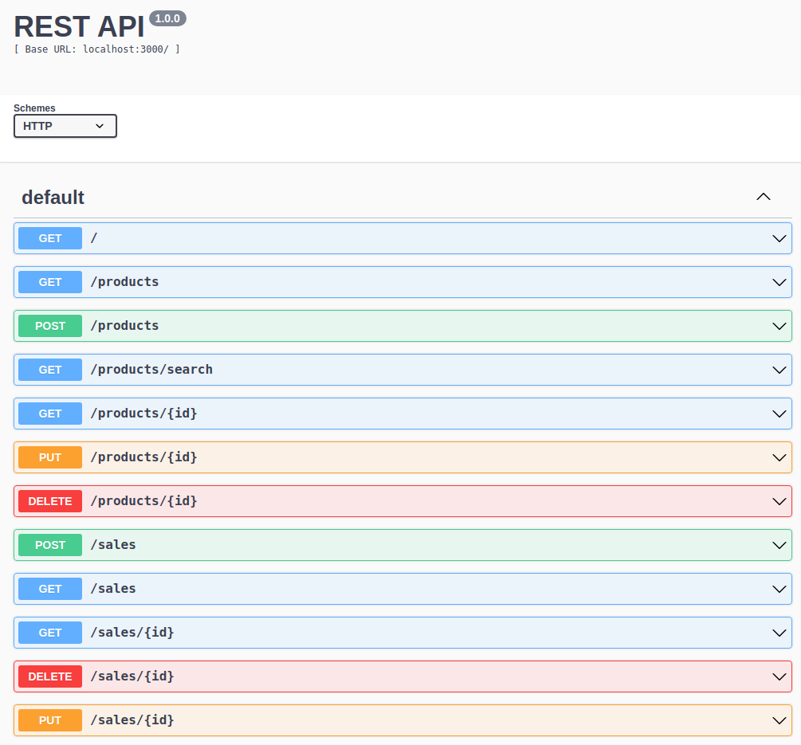

# Projeto Store Manager



Este foi o projeto o qual colocamos em prática a arquitetura MSC!

Ficamos responsáveis por desenvolver uma API através da arquitetura MSC, utilizando o MySQL2 para conectar com o banco de dados e executar as *queries* SQL.

Foi desenvolvida também uma documentação para aplicação, utilzando o Swagger. Para acessar a documentação, basta seguir os passos do próximo tópico.

---

## Instalando a aplicação

Para clonar o repositório para a sua máquina e instalar as dependências, basta rodar o comando: 

- *Para chave SSH* 

```
git clone git@github.com:andremoraes98/store-manager.git && cd store-manager && npm install
```

Depois das dependências instaladas, basta rodar o comando:

```
npm start
```

Feito isso, a aplicação estará rodando localmente. Se não configurada uma porta específica em uma variável de ambiente, ela roda, por padrão, na porta 3000.

Depois que ela estiver rodando, basta acessar o endpoint ``/doc`` para ter acesso à aplicação e testar.

---

# Habilidades

- Utilizar o TypeScript para desenvolver uma API;
- Tipar os principais recursos do Express;
- Validar o usuário através do JSON Web Token;
- Manipular tabelas no banco de dados, fazendo inserções, alterações e exclusões.

---

## Requisitos

Ao todo foram 20 requisitos:

#### 1. Crie endpoints para listar produtos;

#### 2. Desenvolva testes que cubram no mínimo 5% das camadas da sua aplicação;

#### 3. Crie endpoint para cadastrar produtos;

#### 4. Crie validações para produtos;

#### 5. Desenvolva testes que cubram no mínimo 10% das camadas da sua aplicação;

#### 6. Crie endpoint para validar e cadastrar vendas;

#### 7. Desenvolva testes que cubram no mínimo 15% das camadas da sua aplicação;

#### 8. Crie endpoints para listar vendas;

#### 9. Desenvolva testes que cubram no mínimo 20% das camadas da sua aplicação;

#### 10. Crie endpoint para atualizar um produto;

#### 11. Desenvolva testes que cubram no mínimo 25% das camadas da sua aplicação;

#### 12. Crie endpoint para deletar um produto;

#### 13. Desenvolva testes que cubram no mínimo 30% das camadas da sua aplicação;

#### 14. Crie endpoint para deletar uma venda;

#### 15. Desenvolva testes que cubram no mínimo 35% das camadas da sua aplicação;

#### 16. Crie endpoint para atualizar uma venda;

#### 17. Desenvolva testes que cubram no mínimo 40% das camadas da sua aplicação;

#### 18. Crie endpoint products/search?q=searchTerm;

#### 19. Desenvolva testes que cubram no mínimo 50% das camadas da sua aplicação;

#### 20. Desenvolva testes que cubram no mínimo 60% das camadas da sua aplicação.